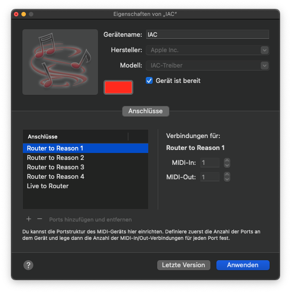

# 8tlr-router

_Routes MIDI messages from Ableton Live to Reason_

## Getting started

### MIDI setup

The idea of this project is to use eight tracks in the Ableton Live session view
to control up to 64 devices in the Reason rack independently.

To make this work, you have to use the macOS app _Audio MIDI Setup_ to configure
five new IAC ports. One port is used to send MIDI messages from Live to
_8tlr-router_, four ports are used to send MIDI messages from _8tl-router_ to
Reason.



### Configuration file

After adding the ports using the _MIDI Studio_ in the _Audio MIDI Setup_ app,
create a configuration file called _8tlr-router.config.yaml_, either in your
home directory, or whereever you are planning to run the _8tlr-router_.

The config file should define your MIDI ports like so:

```
---
portName:
  input: IAC Live to Router
  output:
    - IAC Router to Reason 1
    - IAC Router to Reason 2
    - IAC Router to Reason 3
    - IAC Router to Reason 4
```

### Installing the program

You should have an up-to-date version of [Node.js](https://nodejs.org/)
installed. Then you can install _8tlr-router_ with npm:

```
npm install -g 8tlr-router@latest
```

You can confirm the installation worked by checking the version:

```
8tlr-router -V
```

## Usage

Run the _8tlr-router_ by executing it on the command line:

```
8tlr-router
```

By default, the _8tlr-router_ does its job very quietly, i.e. it does not write
a lot of output to the terminal it's running in.

If you want verbose output, run it with a `DEBUG` environment variable set, like
so:

```
DEBUG=* 8tlr-router
```

This will log the processing of every incoming MIDI message.
